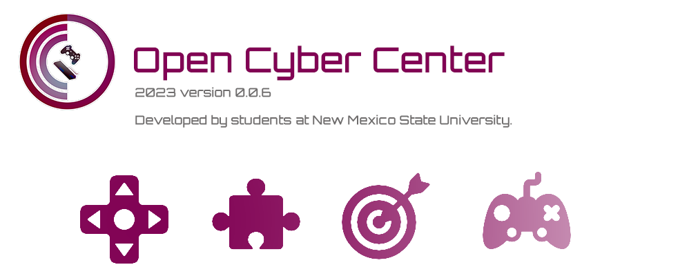

This is the home of Open Cyber Center. This software is a compatibility layer to Windows that allows gaming cafes or other shared computer centers a secure and efficient way to manage user access to their systems. 


Track our development @ https://trello.com/b/RvS0hcib/open-cyber-cafe 


# Dev Install Instructions
```
git clone git@github.com:JiveyGuy/open_cyber_center.git
cd open_cyber_center\main_project\occ
npm install
npm run tauri dev
```

# How To Make a New Prototype
```
cd open_vyber_center/prototypes
npm create tauri-app@latest
  ✔ Project name · <prototyoe_name>
  ✔ Package name · <prototyoe_name>
  ✔ Choose which language to use for your frontend · TypeScript / JavaScript - (pnpm, yarn, npm)
  ✔ Choose your package manager · npm
  ✔ Choose your UI template · Vue - (https://vuejs.org)
  ✔ Choose your UI flavor · TypeScript
```
